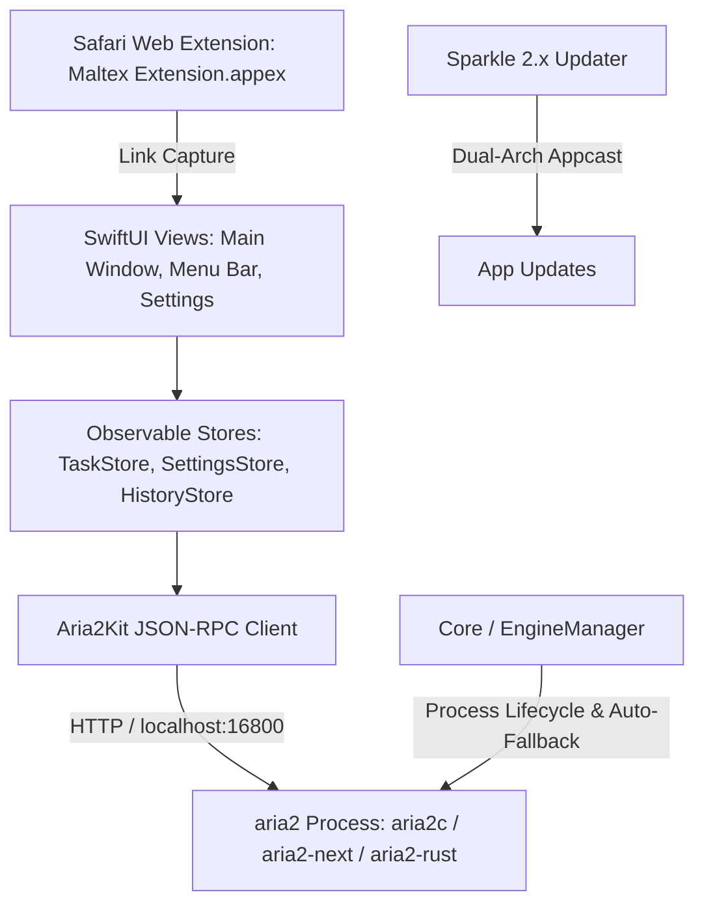

# System architecture

## Layer Responsibilities

1. **`Maltex/Views/`**: SwiftUI declarative interface (task queues, sidebar with status indicators, inspector panels, settings tabs, menu bar extra popup, `WhatsNewSheetView`).
2. **`Maltex/Store/`**:
   - `TaskStore`: Central task manager, polls `tellActive`, `tellWaiting`, `tellStopped` every 1s, queues RPC mutations to prevent flooding.
   - `SettingsStore`: Persists preferences via `@AppStorage`, manages tracker URLs and engine selections (`.bundled`, `.bundledAria2Next`, `.bundledAria2Rust`, `.commandLine`, `.custom`).
   - `HistoryStore`: Persists completed/removed tasks to Application Support JSON.
3. **`Maltex/Core/`**:
   - `EngineManager`: Process lifecycle owner. Constructs 40+ CLI arguments, resolves architecture-specific binary URLs, executes pre-launch `--version` verification, and manages triple automatic fallback to standard bundled aria2 on failure.
4. **`Maltex/Core/Integrations/`**: Third-party framework adapters (Sparkle updater controllers).
5. **`MaltexExtension/`**: Safari Web Extension target capturing `thunder://`, `ed2k://`, `magnet:`, `.torrent`, and HTTP download links.
