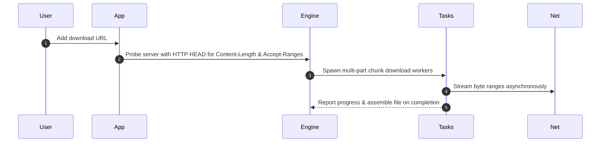

# Key flows

```mermaid
sequenceDiagram
    autonumber
    User->>App: Add download URL
    App->>Engine: Probe server with HTTP HEAD for Content-Length & Accept-Ranges
    Engine->>Tasks: Spawn multi-part chunk download workers
    Tasks->>Net: Stream byte ranges asynchronously
    Tasks-->>Engine: Report progress & assemble file on completion
```
