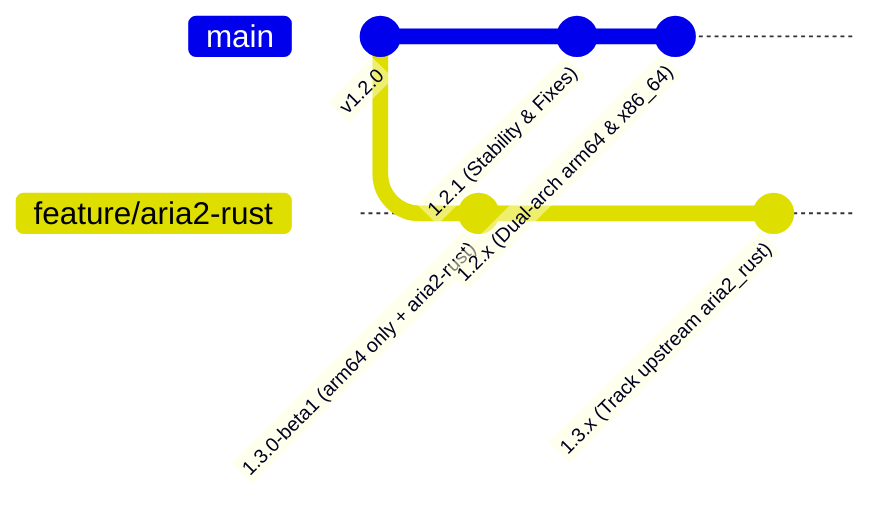

<!-- compiled_truth -->
## Context & Decision

Maltex adopts a **Dual-Track Parallel Development Strategy** starting from August 2026:

### 1. Track A: `1.2.x` Mainline (`main` Branch)
- **Objective**: Ongoing software stability, bug fixes, and maintenance for existing users.
- **Architectures**: Full dual-architecture support (**Apple Silicon arm64** & **Intel x86_64**).
- **Engines**: Standard bundled `aria2c` (v1.37.0 patched) + `aria2-next` (v2.6.4).
- **CI / CD**: Automated GitHub Actions workflow on `CHANGELOG.md` updates.
- **Auto-Update**: Sparkle 2.x dual-architecture appcast with dedicated enclosures per CPU architecture.

### 2. Track B: `1.3.x` Experimental Track (`feature/aria2-rust` Branch)
- **Objective**: Track upstream [aria2_rust](https://github.com/balovess/aria2_rust) development, exploring memory-safe Rust-based download engine capabilities.
- **Architectures**: **Apple Silicon (`arm64`) only**. Intel (x86_64) architecture is permanently dropped on 1.3.x.
- **Engines**: Bundled `aria2c`, `aria2-next`, and experimental `aria2-rust` (v0.3.4+).
- **Fallback**: Triple auto-fallback mechanism to standard `aria2c` on verification failure, crash, or launch error.
- **Release Mode**: Manual GitHub pre-releases (starting with `v1.3.0-beta1`); CI automated build is disabled on this branch.

## Timeline

- time: 2026-08-31T14:37:19
  kind: decision
  summary: "Created this page: Parallel Development Strategy for 1.2.x (Stability) and 1.3.x (aria2-rust)"
  source: created via brain create-page
  affects: [dual-track-branches-v12-v13]

- time: 2026-08-31T14:37:25
  kind: decision
  summary: Define parallel branch strategy for 1.2.x maintenance and 1.3.x aria2-rust experimental track
  source: brain update-truth
  affects: [dual-track-branches-v12-v13]
