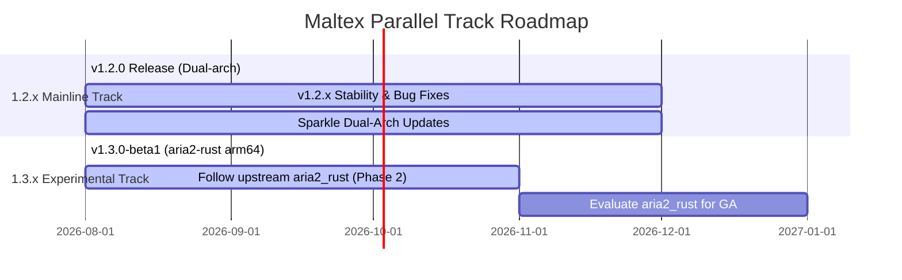

# Roadmap

## Track Details

- **1.2.x Track (`main`)**: Stability-first maintenance, dual-architecture (arm64 & x86_64), automated CI/CD and Sparkle releases.
- **1.3.x Track (`feature/aria2-rust`)**: Innovation track tracking upstream `aria2_rust`, Apple Silicon (arm64) exclusive, manual pre-releases.
